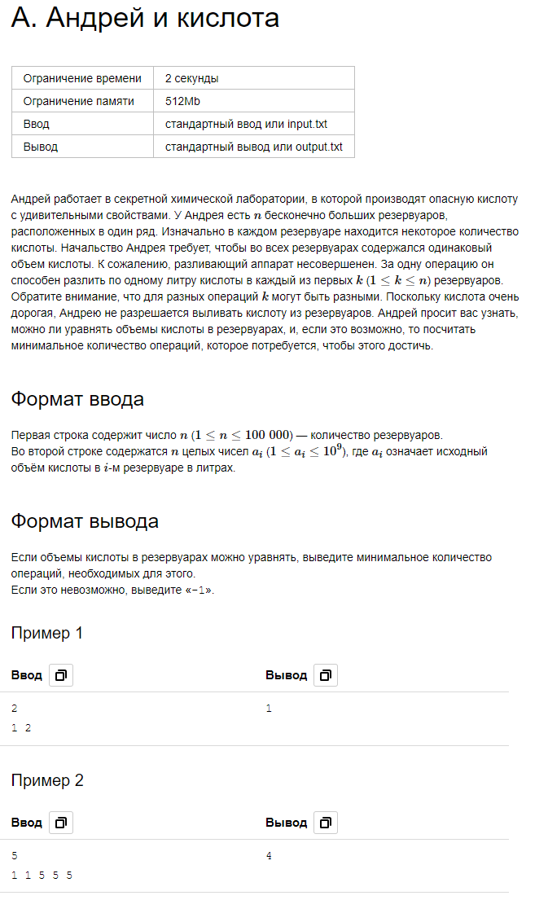
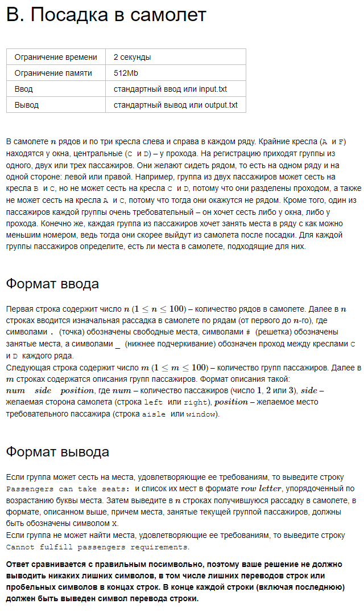

1. Андрей и кислота

Андрей работает в секретной химической лаборатории, в которой производят опасную кислоту с удивительными свойствами. 
У Андрея есть n бесконечно больших резервуаров, расположенных в один ряд. Изначально в каждом резервуаре находится 
некоторое количество кислоты. Начальство Андрея требует, чтобы во всех резервуарах содержался одинаковый объем кислоты. 
К сожалению, разливающий аппарат несовершенен. За одну операцию он способен разлить по одному литру кислоты в каждый 
из первых k(1 ≤ k ≤ n) резервуаров. Обратите внимание, что для разных операций k могут быть разными. 
Поскольку кислота очень дорогая, Андрею не разрешается выливать кислоту из резервуаров. 
Андрей просит вас узнать, можно ли уравнять объемы кислоты в резервуарах, и, если это возможно, то посчитать 
минимальное количество операций, которое потребуется, чтобы этого достичь.

2. Посадка в самолет

В самолете n рядов и по три кресла слева и справа в каждом ряду. Крайние кресла (A и F) находятся у окна, центральные (C и D) – 
у прохода. На регистрацию приходят группы из одного, двух или трех пассажиров. Они желают сидеть рядом, то есть на 
одном ряду и на одной стороне: левой или правой. Например, группа из двух пассажиров может сесть на кресла B и C, но 
не может сесть на кресла C и D, потому что они разделены проходом, а также не может сесть на кресла A и C, потому что 
тогда они окажутся не рядом. Кроме того, один из пассажиров каждой группы очень требовательный – он хочет сесть либо у 
окна, либо у прохода. Конечно же, каждая группа из пассажиров хочет занять места в ряду с как можно меньшим номером, 
ведь тогда они скорее выйдут из самолета после посадки. Для каждой группы пассажиров определите, есть ли места в самолете, 
подходящие для них.

3. 